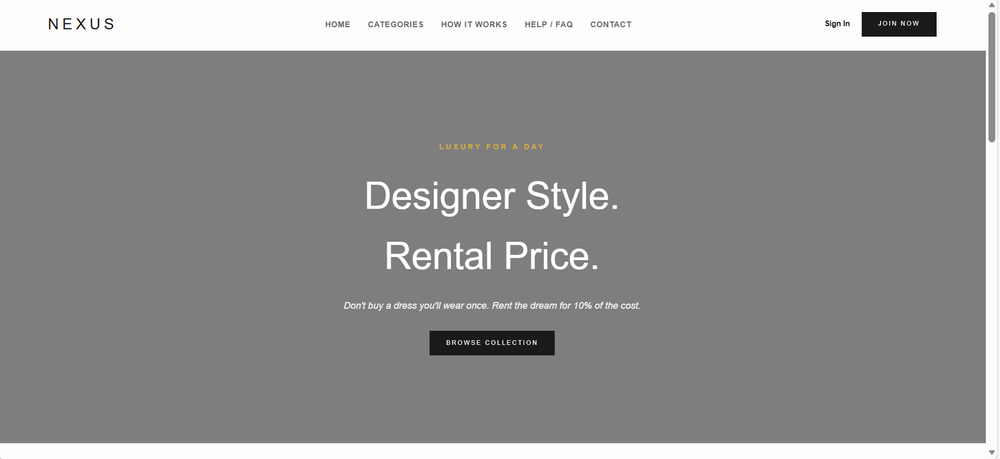

# NEXUS — Premium Luxury Fashion & Dress Rental Platform

> **Designer Style. Rental Price.**  
> Rent high-end couture, premium dresses, and designer outfits for weddings, galas, and special occasions at a fraction of retail price.

---

## 🔗 Live Application & Demo Links

- 🌐 **Live Demo URL:** [https://nexus-main.vercel.app](https://nexus-main.vercel.app) *(Replace with your active Vercel domain)*
- 🎬 **Video Screencast / Walkthrough:** [Watch Product Demo on  Loom](](https://www.loom.com/share/3de89187927549de8074e6c6dcd85cc7)) *(Add your Loom or YouTube video link here)*
- 💻 **GitHub Repository:** [https://github.com/Lakshith07/Nexus-Main](https://github.com/Lakshith07/Nexus-Main)

---

## 📖 About the Project

**NEXUS** is a full-stack e-commerce and rental web platform designed to make luxury fashion accessible and sustainable. Rather than spending thousands of dollars on expensive designer outfits worn only once, users can rent their dream attire for 3, 5, or 7 days with guaranteed fit, dry-cleaning included, and direct home delivery.

The platform provides a modern, fast Single Page Application (SPA) experience built with **React** and **Vite**, backed by a resilient **Node.js / Express** REST API and a serverless **Neon PostgreSQL** database.

---

## ✨ Key Features

### 🛍️ Customer Experience
- **Interactive Catalog & Filtering:** Filter luxury outfits by category (Women, Men, Weddings, Occasions, Children), style, price range, and availability.
- **Dynamic Rental Duration & Pricing:** Choose customized rental periods (3, 5, or 7 days) with dynamic price calculation and refundable security deposits.
- **Live Cart & Order Management:** Add items to cart with date pickers, customize sizing, and track order statuses (Pending, Approved, In-Transit, Returned).
- **Secure Authentication:** User sign-up and sign-in powered by session-based authentication and salted password hashing (`bcryptjs`).
- **Responsive Luxury Design:** Crafted with high-end aesthetic typography (Playfair Display & Montserrat), dark mode luxury accents, and smooth mobile-first animations.

### 👔 Publisher / Admin Dashboard
- **Product Inventory Management:** Add, update, and manage outfits, including rental rates, category tags, and inventory stock.
- **Order Lifecycle Handling:** Approve, dispatch, complete, or reject rental reservations in real-time.
- **Customer Insights:** View user accounts, active rentals, and earnings metrics.

---

## 📸 Screenshots

Here is a glimpse of the NEXUS platform in action:

### 1. Main Landing Page & Hero Section
*Showcasing luxury curated collections, featured items, and dynamic categories.*


---

### 2. User Authentication (Sign In & Sign Up)
*Smooth, secure onboarding and role-based login for customers and publishers.*

| Sign In | Sign Up |
| :---: | :---: |
|  |  |

---

### 3. Publisher & Admin Analytics Dashboard
*Comprehensive dashboard for managing dress rentals, tracking orders, and inventory status.*



---

## 🛠️ Tech Stack & Architecture

- **Frontend:** React 19, Vite, Tailwind-inspired custom luxury CSS, Lucide Icons
- **Backend:** Node.js, Express.js (deployed as Vercel Serverless Functions)
- **Database:** PostgreSQL on [Neon Serverless Postgres](https://neon.tech)
- **Authentication:** Passport.js, Express Session (`connect-pg-simple`), bcryptjs
- **Deployment:** Vercel (Monorepo architecture with client SPA & `/api` serverless rewrites)

---

## 🚀 Getting Started Locally

### Prerequisites
- Node.js (v18 or higher)
- npm (v9 or higher)
- PostgreSQL database URL (Neon or local)

### Installation

1. **Clone the repository:**
   ```bash
   git clone https://github.com/Lakshith07/Nexus-Main.git
   cd Nexus-Main
   ```

2. **Install all dependencies (Root, Client, and Server):**
   ```bash
   npm install
   ```

3. **Configure Environment Variables:**
   Create a `.env` file inside the `server/` folder (or `.env.local` at root):
   ```env
   DATABASE_URL="your-neon-postgres-connection-string"
   SESSION_SECRET="your-super-secret-key"
   PORT=5000
   ```

4. **Run the Development Server:**
   ```bash
   npm run dev
   ```
   - Client: `http://localhost:5173`
   - API Server: `http://localhost:5000`

5. **Build for Production:**
   ```bash
   npm run build
   ```

---

## 👨‍💻 Author

- **Bezawada Lakshith Venkat Sai** - [GitHub Profile](https://github.com/Lakshith07)
